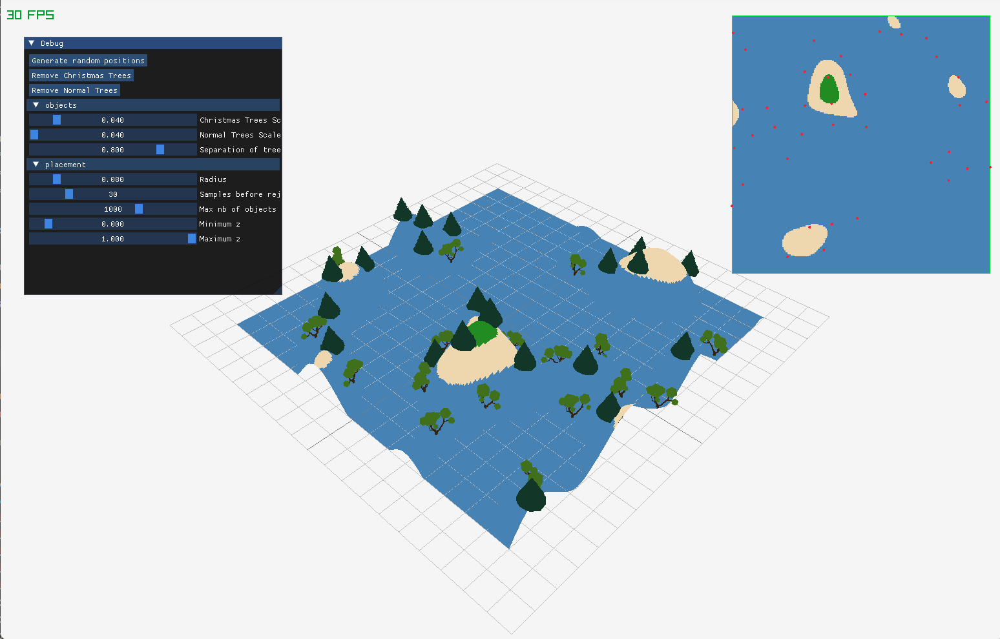

# IMAC_ISLAND_VIEWER_Romane-Chloe

# Rapport de projet

**Projet réalisé par :** Romane MARTEAU--BAZOUNI et Chloé CHABAUD et développé sous Windows.

---

## Question 1 - Bruit fractal (Octave Noise) (Chloé)

J’ai utilisé le premier document fourni dans le sujet :  
https://thebookofshaders.com/13/?lan=fr

L’objectif de cette fonction est de générer un relief naturel (type terrain ou île) en combinant plusieurs couches de bruit.

Les octaves sont une version de bruit à différentes échelles :  
• les premières octaves donnent les grosses formes du terrain (montagnes, continents)  
• les octaves suivantes ajoutent des détails de plus en plus fins

Au final, on superpose tout ça pour obtenir un terrain plus naturel.

On définit :

**Amplitude**  
L’amplitude sert à dire “combien cette octave influence le résultat”. À chaque octave, on réduit l’amplitude avec le gain (souvent < 1), sinon les hautes fréquences prennent trop de place.

**Fréquence**  
La fréquence sert à définir la taille des détails : à chaque octave, on augmente la fréquence.

On construit le résultat avec le bruit à une certaine fréquence, pondéré par son amplitude. Chaque octave ajoute une contribution différente au résultat.

À la fin, on normalise le résultat car les valeurs peuvent dépasser un certain intervalle. On normalise par rapport aux amplitudes, car chaque itération n’a pas le même poids.

---

### Problème rencontré

Au début, j’avais mis une amplitude < 1. Le bruit “fonctionnait”, jusqu’à ce que j’ajoute les couleurs, où j’ai eu un gros problème que j’ai eu du mal à retrouver.

En fait, en mettant une amplitude < 1, je multipliais par ce facteur à chaque octave, donc je réduisais fortement le signal, ce qui donnait un effet inattendu en fonction de la hauteur (zones trop sombres et/ou mal réparties).

---

## Question 2 - Génération de heightmap et couleurs (Chloé)

But : générer une couleur en fonction de la hauteur du point et de sa distance au centre.

J’ai choisi d’utiliser un masque avec une fonction linéaire (possible avec une fonction de la bibliothèque, mais j’ai préféré, pour ma propre compréhension, l’écrire moi-même).

En fonction de la distance, le masque a plus ou moins d’effet. Au-delà d’un certain rayon, c’est de l’eau.

On calcule la distance entre le point et le centre de la carte :  
• plus on est proche du centre → terrain élevé  
• plus on s’éloigne → terrain plus bas

Le fait de mettre le masque au carré permet de renforcer l’effet, sinon la transition était trop faible visuellement.

Le terrain final est obtenu en multipliant :

**height = noise × masque**

• le bruit donne la forme  
• le masque donne la structure d’île

---

## Paramètres fixés

### Génération de la map

#### Noise scale

Contrôle les bosses et le dénivelé.  
Pertinent entre 0 et 10.  
Ce curseur permet de créer des îles différentes (plus ou moins de sommets et de hauteurs différentes).

---

#### Gain

Plage : `[0, 0.6]`  
Contrôle la contribution de chaque octave au bruit.  
Au-delà de 0.6, la map devient trop bruitée et n’est plus lisible.

---

#### Noise lacunarity

Plage : `[0, 1.7]`  
Contrôle l’augmentation de la fréquence entre les octaves (donc le niveau de détail).  
Au-delà de 1.7, la map devient également trop bruitée.

---

#### Noise resolution

Pertinent visuellement sur une plage de 0 à 10.

---
### Difficultés rencontrées

J’ai eu beaucoup de mal à commencer, mais j’ai reçu l’aide d’Agathe, qui m’a expliqué le concept et j’ai pu commencer. J’ai galéré à trouver par quoi il fallait multiplier au début.

Concernant les couleurs, on voulait un dégradé propre donc on a réutilisé la methode de dégradés dans l'espace de couleur Lab ( utilisé dans le workshop de Jules). Il fallait donc adapter cette méthode.

J’ai créé des plages de couleurs, et j’en ai ajouté ensuite avec différentes teintes pour avoir un meilleur rendu.

---

### Problèmes rencontrés

J’ai eu longtemps des problèmes avec les intervalles des vecteurs de couleurs qui devaient passer dans les fonctions, je m’emmêlais. Puis, pour le pourcentage appliqué, il fallait mapper en fonction de l’intervalle où on se trouvait (solution trouvée grâce à Jules). Je suis passée par énormément de couleurs non voulues avant d’avoir un résultat satisfaisant.

---

## Question 3 - Poisson Disk (Romane)

J’ai eu plusieurs problèmes dans la compréhension de l’algorithme.

Une première vidéo (https://www.youtube.com/watch?v=flQgnCUxHlw) m’a aidée à comprendre pas à pas le papier de recherche. Le code était tout de même truffé de fautes et écrit dans un langage Processing que je ne maîtrisais pas trop. Cependant, avec l'aide de Benoit, j'ai pu corriger la plupart des erreurs et comprendre plus en profondeur la structure utilisée.

Pour finir mon code, j’ai donc choisi de suivre une deuxième vidéo (https://www.youtube.com/watch?v=7WcmyxyFO7o) pour avoir les bonnes méthodes et les bonnes pratiques.

Cette méthode permet de générer des points répartis de manière uniforme, avec la possibilité de réduire ou augmenter le nombre de points, ainsi que de modifier le rayon d'espacement

---

## Question 4 - Placement des objets (Romane)

Les deux questions sur les objets ont été réalisées sans la map de Chloé, donc avec une île assez moche (très plate). D’où les sliders minimum_z et maximum_z qui sont dans des plages de valeurs très larges pour pouvoir s'adapter à n'importe quelle île.

On peut choisir les valeurs d'altitude z (min ou max), ce qui permet de contrôler le placement des objets.

---

## Question 5 - Améliorations (Romane)

J’ai importé deux meshs 3D (deux types d’arbres : des sapins et arbres assez normaux) avec l’aide de Kellian, séparés en fonction des valeurs de z. Les meshs ont été trouvés sur [Free3D](https://www.free3D.com). Ce sont des fichiers .obj triangulés avec des fichiers .mtl pour les textures et couleurs.

Chaque arbre normal a une orientation différente (les sapins, non, puisqu'ils sont uniformes dans leur forme). On peut modifier leur taille et leur emplacement.

---
## Difficultés rencontrées

Le code de Poisson Disk Sampling est celui qui m'a pris le plus de temps. J'ai, comme dit au dessus, passé du temps sur les deux vidéos et donc perdu beaucoup d'énergie à essayer de traduire le code Java en C++.

L'importation des meshs 3D a été compliquée au début à cause du format des fichiers .obj. Le principe n'a pas posé trop problème. La difficulté venait aussi du fait que les meshs étaient pour certains très lourds, ce qui compliquait leur intégration.

---
## Paramètres fixés

#### Objets

- Hauteur des sapins entre 0.03 et 0.1 : pertinent visuellement en fonction de la hauteur de l'île
- Hauteur des arbres entre 0.05 et 0.7
- Altitude au delà de laquelle il n'y a que des sapins entre 0.01 et 2

---

#### Placement des objets

- Rayon d'espcement des objets entre 0 et 0.3 car à partir de 0.5, il ne reste plus que 2 à 3 objets environ
- Nombre maximal d'objets sur l'île entre 10 et 1500
- Altitudes minimales et maximales de placement des arbres

---

## Organisation du travail

Nous sommes parties sur environ deux questions chacune, avec des points de rendez-vous réguliers pour montrer l’avancement du projet, demander des avis et poser des questions.

---

## Gestion du Git

Nous avons travaillé sur deux branches différentes.

Chloé a commencé sur une branche Noise ( une branche par exercice était initialement prévue, mais finalement, pour éviter les erreurs, tout a été regroupé sur une seule branche). Commits faits à chaque fois qu’une question était terminée ou qu’une amélioration/correction était complète.

Romane a effectué une branche par question ( 3 en tout avec amélioration) : 1 sur le poisson (placement en fonction de x et y), 1 pour le placement des arbres en fonction de z, 1 pour l'amélioration (les meshs 3d et leurs propriétés)

Nous faisions des commits réguliers sur la branche principale (main), puis nous avons décidé de merger uniquement à la fin du projet et de gérer les conflits ensemble.

Enfin le marge final a été fait ensemble sur le pc de Romane pour régler ensemble les conflicts

### A MODIFIER

## Post mortem :
